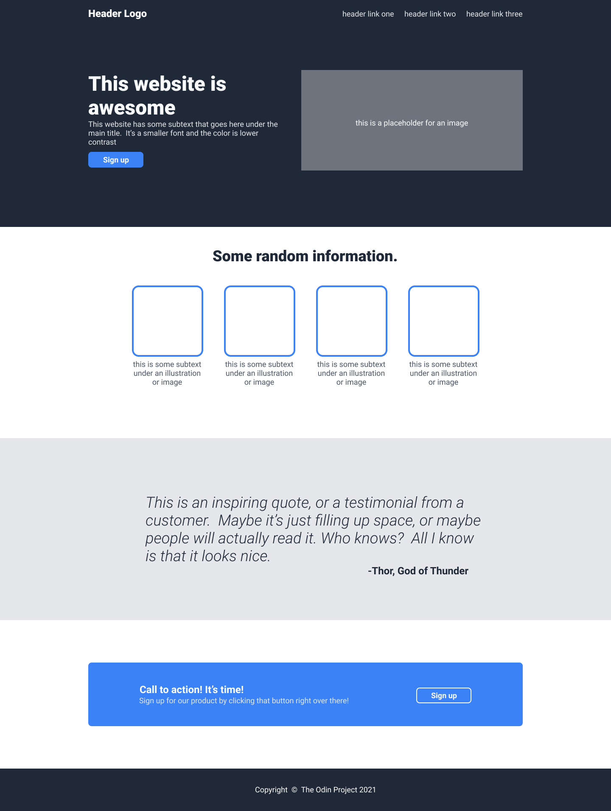

# landing-page

Introduction

This project is about making a simple landing page. It is referring to a "Odins Project" template:

This landing page is showing an art portfolio of my own cartoon graphics. It contains a logo, a simple introduction, exemples of my sketches, an inspiring quote and a 'contact with me' button.

This project is made with use of some basic html, css and (a first-time used in my own project) flexbox.